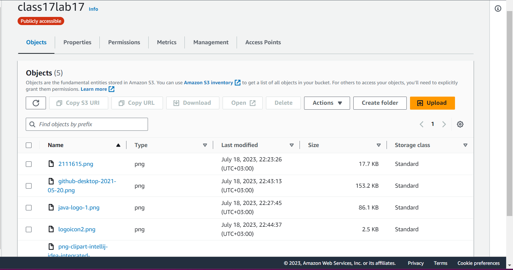
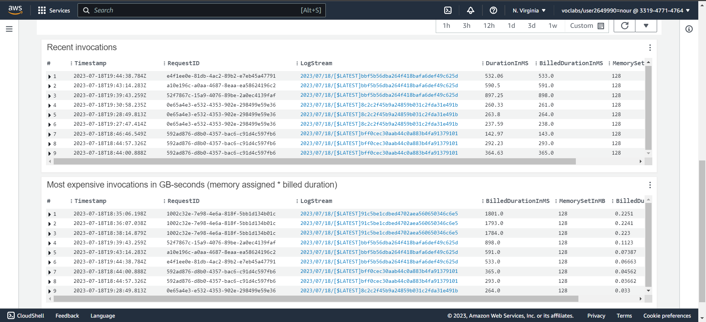

# image-lambda

## Lambda Description:
The lambda function I created allows users to upload images of any size to an S3 bucket. When an image is uploaded, the lambda function triggers and performs the following actions:

1. Downloads the "images.json" file from the S3 bucket, if it exists.
2. Creates an empty array in "images.json" if the file is not present.
3. Generates metadata for the uploaded image, including Name, Size, and Type.
4. Appends the metadata object to the array in "images.json".
5. If the uploaded image has a duplicate name, the function updates the corresponding object in the array instead of adding a new entry.
6. Uploads the updated "images.json" file back to the S3 bucket.

## uploaded images

## log 

## Issues Encountered:
During the deployment of this lambda function, I encountered a few challenges. most challenging one, I had to ensure that the necessary IAM permissions were set up correctly to allow the lambda function to access the S3 bucket and perform the required actions. 

